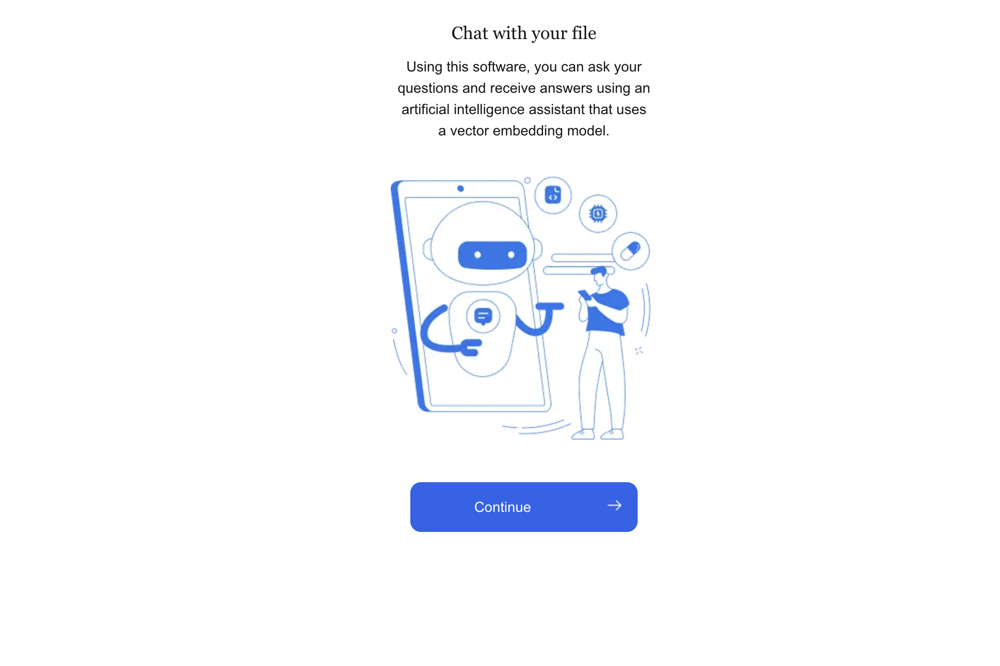
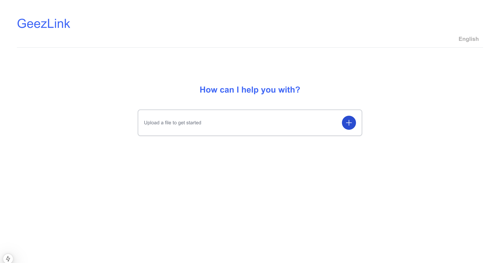

# GeezChat - Multilingual Document Assistant 🇪🇹

[](https://opensource.org/licenses/MIT)

A multilingual chat interface for document analysis, optimized for Amharic language support. Interact with your PDFs, Word docs, and text files through natural conversation.


## 🌍 Project Focus
**GeezChat specializes in:**

- Amharic language processing with Geez script support

- Secure document handling

- Session-based conversations

- multilingual support

## 🌟 Key Features

**Frontend**
- Session management with local storage
- Multi-format file upload (PDF)
- Chat interface with message history
- 24-hour session expiration
- Amharic-first with multilingual support

**Backend**
- Document processing pipeline
- Session management API
- Google Gemini integration
- RESTful endpoints for chat interactions
- File content analysis

## 🛠 Tech Stack

**Frontend**  
Next.js 14 | Tailwind CSS | React Hook Form | Axios

**Backend**  
FastAPI | Python 3.10+ | Google Generative AI | PyPDF2

## 🚀 Getting Started

### Prerequisites
- Node.js 18+
- Python 3.10+
- Google API key
-OpenAI API Key( optional)

### Installation
```bash
# Clone main branch only
git clone -b main https://github.com/abdulmunimjemal/geez-link.git
cd geezchat

# Frontend setup
cd frontend/chat-with-ur-file && npm install

# Backend setup
cd ../backend && pip install -r requirements.txt

```

### Environment Setup
Create .env.local:

```
NEXT_PUBLIC_API_URL=http://localhost:8000
GEMINI_API_KEY=your_google_api_key
MODEL_PROVIDER=gemini/openai(choose one)
```

### Running
```
# Start backend
cd backend && uvicorn app.main:app --reload

# Start frontend
cd frontend/chat-with-ur-file && npm run dev
```
### Demo




